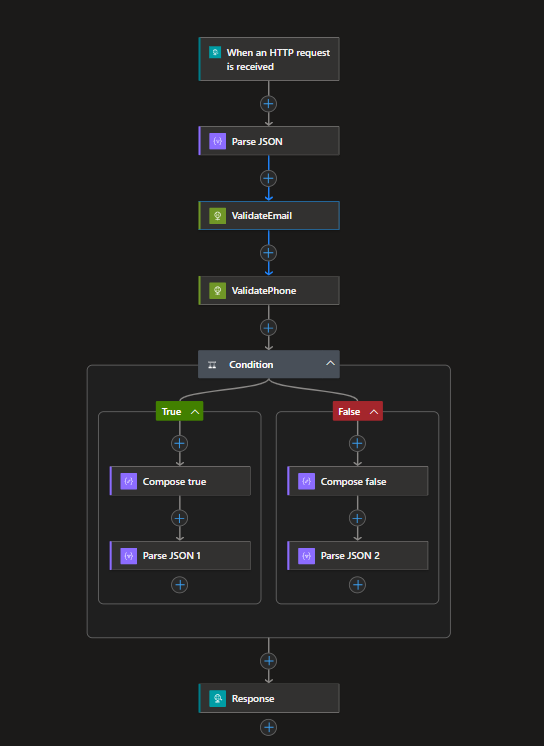
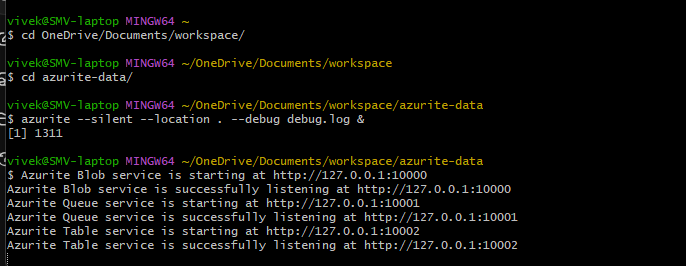
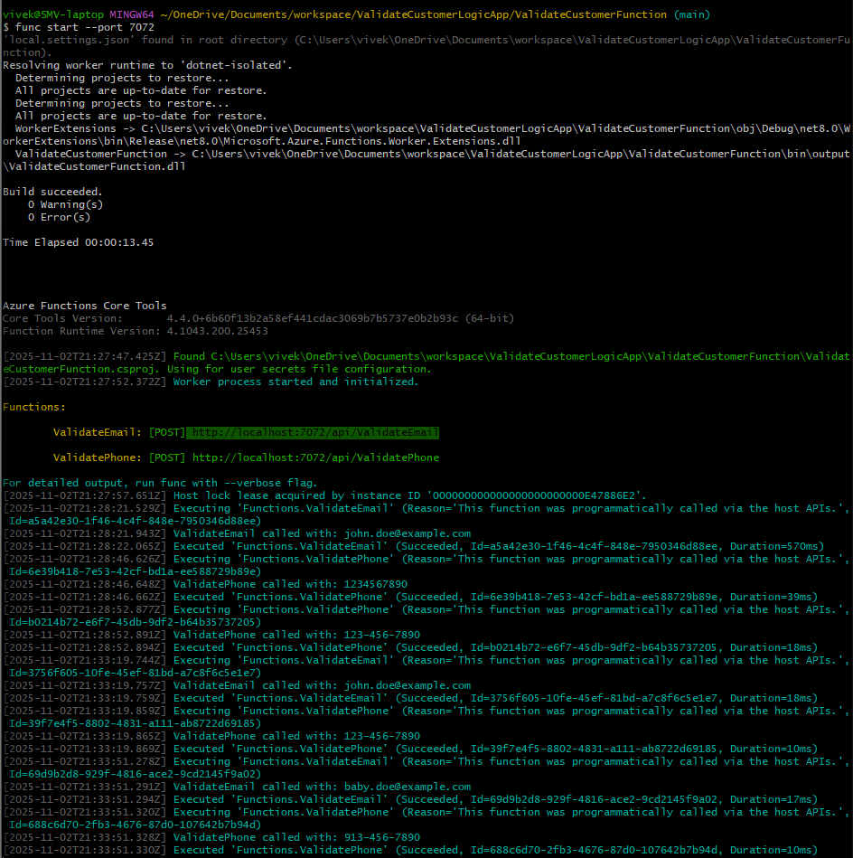
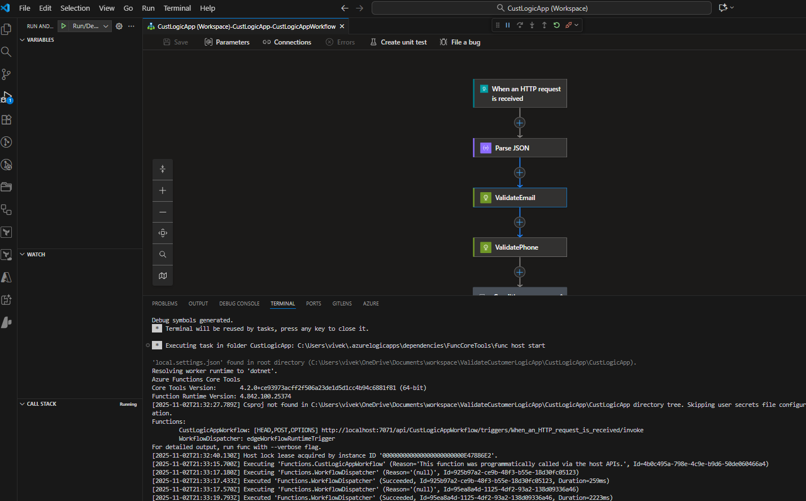
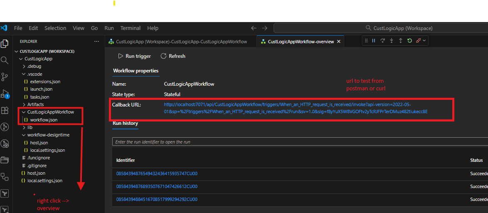

# Customer Validation Logic App Solution

This solution demonstrates an Azure Logic App integrated with Azure Functions to validate customer email and phone number inputs. The solution consists of three main components:

1. **ValidationLibrary**: A .NET library containing email and phone validation logic
2. **ValidateCustomerFunction**: Azure Functions that expose validation endpoints
3. **CustLogicApp**: Azure Logic App that orchestrates the validation workflow



## Prerequisites

### Windows Setup

1. **Visual Studio Code**
   - Download and install from [VS Code](https://code.visualstudio.com/)
   - Required Extensions:
     - Azure Tools (`ms-vscode.vscode-node-azure-pack`)
     - Azure Functions (`ms-azuretools.vscode-azurefunctions`)
     - Azure Logic Apps (Standard) (`ms-azuretools.vscode-azurelogicapps`)
     - C# (`ms-dotnettools.csharp`)

2. **.NET SDK**
   - Download and install [.NET 8.0 SDK](https://dotnet.microsoft.com/download/dotnet/8.0)

3. **Azure Functions Core Tools**
   ```powershell
   winget install Microsoft.AzureFunctionsCoreTools
   # Or using npm
   npm install -g azure-functions-core-tools@4
   ```

4. **Azurite (Azure Storage Emulator)**
   ```powershell
   npm install -g azurite
   ```

### macOS Setup

1. **Visual Studio Code**
   - Download and install from [VS Code](https://code.visualstudio.com/)
   - Install same extensions as Windows setup

2. **.NET SDK**
   ```bash
   brew install dotnet@8
   ```

3. **Azure Functions Core Tools**
   ```bash
   brew tap azure/functions
   brew install azure-functions-core-tools@4
   ```

4. **Azurite**
   ```bash
   npm install -g azurite
   ```

## Building and Running the Solution

### 1. Start Azurite (Local Storage Emulator)
Open a terminal and run:
```bash
azurite --silent --location . --debug debug.log &
```

You should see output similar to:
```
Azurite Blob service is starting at http://127.0.0.1:10000
Azurite Queue service is starting at http://127.0.0.1:10001
Azurite Table service is starting at http://127.0.0.1:10002
```


### 2. Build ValidationLibrary
```powershell
cd ValidationLibrary
dotnet build
```

### 3. Build and Start ValidateCustomerFunction
```powershell
cd ../ValidateCustomerFunction
dotnet build
func start --port 7072
```

You should see output indicating the functions are running:
```
ValidateEmail: [POST] http://localhost:7072/api/ValidateEmail
ValidatePhone: [POST] http://localhost:7072/api/ValidatePhone
```


### 4. Deploy Logic App Workflow
1. Open the `CustLogicApp` folder in VS Code
2. Navigate to the `workflow.json` file
3. The Logic App workflow will automatically start in the local development environment
4. Once in the Logic App workspace Run the app as .Net function to start the app as shown in following figure



## Testing the Solution

### Retrieving URL for LogicApp w/ signature

1. Go to your Logic App workspace and access the workflow.json file
2. Right click and go to overview to retrieve the url as shown in following figure



### Using Postman

1. Create a new POST request to the Logic App endpoint (shown in VS Code when you run the workflow)
2. Set the request body to:
```json
{
    "customerId": "456789",
    "email": "baby.doe@example.com",
    "phoneNumber": "913-456-7890"
}
```
3. Send the request and observe the validation results
4. Sample postman collections are provided in repo folder correspondingly

### Using curl

- change the URL per local configuration
```bash
curl -X POST http://localhost:7071/api/CustLogicAppWorkflow/triggers/When_an_HTTP_request_is_received/invoke?api-version=2022-05-01&sp=%2Ftriggers%2FWhen_an_HTTP_request_is_received%2Frun&sv=1.0&sig=f8yYuX5W8VGOFtv2yTcRJFPrTerDMuz482tiukecc8E \
     -H "Content-Type: application/json" \
     -d "{\"customerId\": \"12345\",\"email\": \"john.doe@example.com\",\"phoneNumber\": \"123-456-7890\"}
```

## Validation Rules

### Email Validation
- Must be a valid email format (e.g., user@domain.com)
- Cannot be empty or null
- Uses standard email format validation

### Phone Validation
- Supports US phone number format
- Optional +1 country code
- Supports formats: XXX-XXX-XXXX, (XXX) XXX-XXXX, etc.
- Cannot be empty or null

## Architecture Overview

The solution follows this flow:
1. HTTP request triggers Logic App workflow
2. Logic App parses input JSON
3. Calls ValidateEmail and ValidatePhone functions in parallel
4. Aggregates results and returns response

## Troubleshooting

### Common Issues

1. **Azurite Connection Issues**
   - Ensure no other process is using the default ports (10000, 10001, 10002)
   - Check if Azurite is running with `ps aux | grep azurite`

2. **Function App Won't Start**
   - Verify port 7072 is not in use
   - Check if .NET SDK is properly installed
   - Ensure all dependencies are restored

3. **Logic App Issues**
   - Verify workflow.json syntax
   - Check VS Code Azure Logic Apps extension is properly installed
   - Ensure function app endpoints are accessible

### Logs Location
- Function App logs: Check the terminal running the function app
- Azurite logs: Check debug.log in the Azurite directory
- Logic App logs: Check VS Code's OUTPUT panel under "Logic App"

## Additional Resources

- [Azure Functions documentation](https://docs.microsoft.com/azure/azure-functions/)
- [Azure Logic Apps documentation](https://docs.microsoft.com/azure/logic-apps/)
- [Azurite documentation](https://docs.microsoft.com/azure/storage/common/storage-use-azurite)
